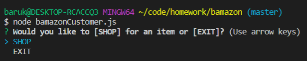
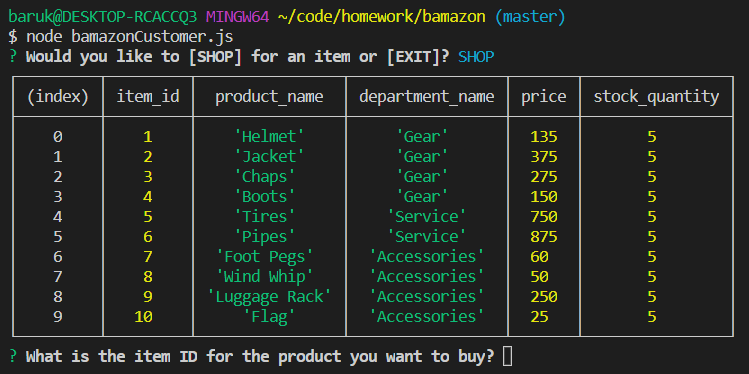
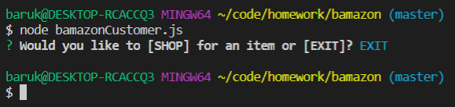
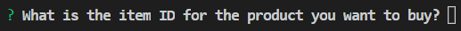
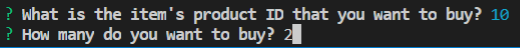
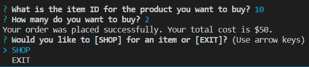
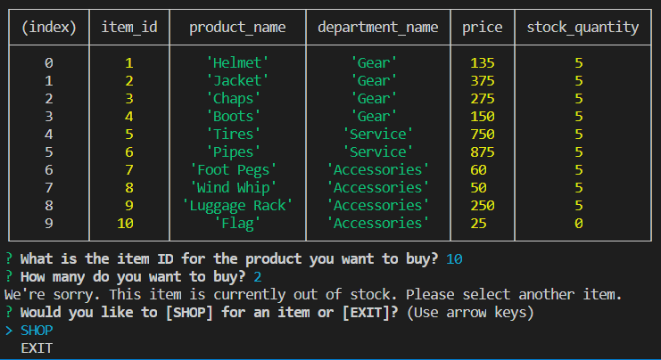

# Node.js & MySQL

### Challenge #1: Customer View (Minimum Requirement)

### Overview

In this assignment, I created an Amazon-like storefront CLI (command-line interface or command language interpreter) app called `bamazon` that accepts orders from customers and depletes stock from the storefront's inventory.

### Steps Of Creation:

1. I created a MySQL database called `bamazon`.

2. I created a table inside of that database called `products`.

3. The products table has the following five columns:

   * `item_id` (unique id for each product)

   * `product_name` (name of product)

   * `department_name`

   * `price` (cost to customer)

   * `stock_quantity` (how much of the product is available in store)

4. I populated this database with 10 different products. (I inserted "mock" data rows into this database and table.)

5. I created a Node application called `bamazonCustomer.js`. Running this application first prompts the user: `"Would you like to [SHOP] for an item or [EXIT]?"`

`Example: node bamazonCustomer.js`

`Output:`

   * If the user selects [SHOP], it displays all of the items available for sale with their item_ids, product names, department names, prices, and stock quantities.

`Selection: SHOP`

`Output:`

   * If the user selects [EXIT], it exits the program.

`Selection: EXIT`

`Output:`

6. The app then prompts the user with two messages:

   * The first message asks the user, `"What is the item's product ID that you want to buy?"`

`Output:`

   * The second message asks the user, `"How many do you want to buy?"`

`Example Selection: Flags (item_id 10), Quantity 2`

`Output:`

7. Once the customer has placed the order, the application checks if the storefront has enough of the product to meet the customer's request.

   * If the storefront has enough of the product, the app processes the customer's order and logs the phrase `"Your order was placed successfully."`

   * Once the update processes, the customer is shown the total cost of their purchase.

   * The SQL database updates to reflect the remaining quantity.

   * The user is then prompted to shop or exit.

`Output:`

   * If not, the app logs, `"We're sorry. Insufficient product quantity. Please select another item,"` and then prevents the order from processing.

`Output:`

### Challenge #2: Manager View (Next Level)

* Create a new Node application called `bamazonManager.js`. Running this application will:

  * List a set of menu options:

    * View Products for Sale
    
    * View Low Inventory
    
    * Add to Inventory
    
    * Add New Product

  * If a manager selects `View Products for Sale`, the app should list every available item: the item IDs, names, prices, and quantities.

  * If a manager selects `View Low Inventory`, then it should list all items with an inventory count lower than five.

  * If a manager selects `Add to Inventory`, your app should display a prompt that will let the manager "add more" of any item currently in the store.

  * If a manager selects `Add New Product`, it should allow the manager to add a completely new product to the store.

- - -

* If you finished Challenge #2 and put in all the hours you were willing to spend on this activity, then rest easy! Otherwise continue to the next and final challenge.

- - -

### Challenge #3: Supervisor View (Final Level)

1. Create a new MySQL table called `departments`. Your table should include the following columns:

   * department_id

   * department_name

   * over_head_costs (A dummy number you set for each department)

2. Modify the products table so that there's a product_sales column, and modify your `bamazonCustomer.js` app so that when a customer purchases anything from the store, the price of the product multiplied by the quantity purchased is added to the product's product_sales column.

   * Make sure your app still updates the inventory listed in the `products` column.

3. Create another Node app called `bamazonSupervisor.js`. Running this application will list a set of menu options:

   * View Product Sales by Department
   
   * Create New Department

4. When a supervisor selects `View Product Sales by Department`, the app should display a summarized table in their terminal/bash window. Use the table below as a guide.

| department_id | department_name | over_head_costs | product_sales | total_profit |
| ------------- | --------------- | --------------- | ------------- | ------------ |
| 01            | Electronics     | 10000           | 20000         | 10000        |
| 02            | Clothing        | 60000           | 100000        | 40000        |

5. The `total_profit` column should be calculated on the fly using the difference between `over_head_costs` and `product_sales`. `total_profit` should not be stored in any database. You should use a custom alias.

6. If you can't get the table to display properly after a few hours, then feel free to go back and just add `total_profit` to the `departments` table.

   * Hint: You may need to look into aliases in MySQL.

   * Hint: You may need to look into GROUP BYs.

   * Hint: You may need to look into JOINS.

   * **HINT**: There may be an NPM package that can log the table to the console. What's is it? Good question :)

### Reminder: Submission on BCS

* Please submit the link to the Github Repository!

- - -

### Minimum Requirements

Attempt to complete homework assignment as described in instructions. If unable to complete certain portions, please pseudocode these portions to describe what remains to be completed. Adding a README.md as well as adding this homework to your portfolio are required as well and more information can be found below.

- - -

### Create a README.md

Add a `README.md` to your repository describing the project. Here are some resources for creating your `README.md`. Here are some resources to help you along the way:

* [About READMEs](https://help.github.com/articles/about-readmes/)

* [Mastering Markdown](https://guides.github.com/features/mastering-markdown/)

- - -

### Add To Your Portfolio

After completing the homework please add the piece to your portfolio. Make sure to add a link to your updated portfolio in the comments section of your homework so the TAs can easily ensure you completed this step when they are grading the assignment. To receive an 'A' on any assignment, you must link to it from your portfolio.

- - -

### One More Thing

If you have any questions about this project or the material we have covered, please post them in the community channels in slack so that your fellow developers can help you! If you're still having trouble, you can come to office hours for assistance from your instructor and TAs.

**Good Luck!**
