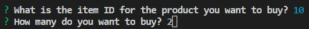

# Node.js & MySQL

### Challenge #1: Customer View

### Overview

In this assignment, I created an Amazon-like store CLI (command-line interface or command language interpreter) app called `bamazon` that accepts customers' orders and depletes stock from the store's inventory.

### Steps Of Creation:

1. I created a MySQL database called `bamazon`.

2. In this database I created a table called `products` with the following five columns:

   * `item_id` (unique id for each product)

   * `product_name`

   * `department_name`

   * `price` (cost to customer)

   * `stock_quantity` (how much of the product is available in the store)

3. I inserted "mock" data rows into this table to populate it with the following 10 motorcycle products:

   * `Helmet`

   * `Jacket`

   * `Chaps`

   * `Boots`

   * `Tires`

   * `Pipes`

   * `Foot Pegs`

   * `Wind Whip`

   * `Luggage Rack`

   * `Flag`

4. I created a Node application called `bamazonCustomer.js`.

### Functionality

Running the Node application `bamazonCustomer.js` first prompts the user: `"Would you like to [SHOP] for an item or [EXIT]?"`

`Example: node bamazonCustomer.js`

`Output:`

   * If the user selects [EXIT], it exits the program.

`Selection: EXIT`

`Output:`

   * If the user selects [SHOP], it displays all the items available for sale with their item id, product name, department name, price, and stock quantity.

`Selection: SHOP`

`Output:`

The app then prompts the user with two messages:

   * The first message asks the user: `"What is the item ID for the product you want to buy?"`

`Output:`

   * The second message asks the user: `"How many do you want to buy?"`

`Example Selection: Flag (item_id 10), Buy (2)`

`Output:`

Once the customer has placed the order, the application checks if the store has enough of the product to meet the customer's request.

   * If the store has enough in stock, the app processes the customer's order and logs the phrase `"Your order was placed successfully."`

      * Once the update processes, the app notifies the customer the total cost of their purchase by logging the phrase `"Your total cost is $[]."`

      * The SQL database updates to reflect the remaining product quantity.

      * The user is then prompted to shop or exit.

`Output:`

   * If not, the app logs, `"We're sorry. This item is currently out of stock. Please select another item,"` and then prevents the order from processing.

      * The SQL database shows the current product quantity.

      * The user is then prompted to shop or exit.

`Example Selection: Flag (item_id 10), Buy (2)`

`Output:`

